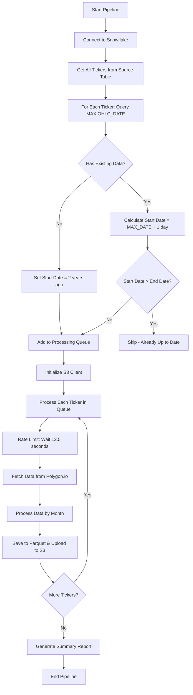

# Incremental OHLCV Data Pipeline

## Overview

The Incremental OHLCV Pipeline is designed to efficiently download only the **new** OHLCV data for each ticker since the last stored date in the Snowflake table. This approach minimizes API calls, reduces processing time, and ensures data freshness without redundant downloads.

## Key Features

### 🎯 **Smart Incremental Loading**
- Queries Snowflake to find the **maximum date** for each ticker using: `SELECT MAX(OHLC_DATE) FROM sp500_top10_sector_ohlcv_itbl WHERE TICKER = 'AAPL'`
- Downloads data **only after** the last stored date for each ticker
- Automatically handles tickers with no existing data (downloads from 2 years ago)
- Skips tickers that are already up-to-date

### 📊 **Intelligent Date Range Management**
- **End Date**: Automatically calculated based on current day and weekends
  - Weekdays: Uses yesterday (markets close after trading day)
  - Saturday: Uses Friday
  - Sunday: Uses Friday
- **Start Date**: Day after the maximum stored date for each ticker
- **No Data Case**: Downloads from 2 years ago if no existing data found

### 🔄 **Production-Ready Pipeline**
- **Rate Limiting**: 12.5-second delays between API calls (5 calls/minute for Polygon.io free tier)
- **Error Handling**: Comprehensive error handling for all operations
- **Logging**: Detailed logging to both console and file (`incremental_ohlcv_pipeline.log`)
- **S3 Integration**: Direct upload to S3 bucket with proper schema
- **Snowflake Compatibility**: Uses TIMESTAMP_MICROS format for optimal Snowflake performance

## Usage

### Prerequisites

1. **Environment Variables**:
   ```bash
   export POLYGON_API_KEY=your_polygon_io_api_key_here
   ```

2. **Snowflake Connection**: Configured in `~/.snowflake/connections.toml` with connection name `DEMO_PRAJAGOPAL`

3. **AWS Credentials**: Configured in `~/.aws/credentials`

### Running the Pipeline

#### 1. Test the Pipeline (Recommended First Step)
```bash
python test_incremental_pipeline.py
```

This will verify:
- ✅ Snowflake connection and ticker retrieval
- ✅ Max date queries for sample tickers
- ✅ Date range calculation logic
- ✅ S3 bucket access
- ✅ Polygon.io API connectivity

#### 2. Run the Incremental Pipeline
```bash
python incremental_ohlcv_pipeline.py
```

### Sample Output

```
================================================================================
INCREMENTAL OHLCV PIPELINE FOR SP500 SECTOR LEADERS
================================================================================
End date: 2025-09-12
S3 Bucket: sp500-top-10-sector-leaders-ohlcv-s3bkt
Snowflake Table: sp500_top10_sector_ohlcv_itbl

Step 1: Analyzing existing data and determining date ranges...
Max date for AAPL: 2025-09-04
Will download AAPL from 2025-09-05 to 2025-09-12
Max date for MSFT: 2025-09-04
Will download MSFT from 2025-09-05 to 2025-09-12
...
Found 111 tickers that need data updates

Step 2: Initializing S3 client...
S3 client initialized successfully

Step 3: Processing tickers with incremental data...
Processing ticker 1/111: AAPL
Fetching data for AAPL from 2025-09-05 to 2025-09-12
Successfully retrieved 6 records for AAPL
✓ Successfully processed AAPL

================================================================================
INCREMENTAL PIPELINE SUMMARY
================================================================================
Total tickers analyzed: 111
Tickers needing updates: 111
Successfully processed: 111
Failed: 0
Success rate: 100.0%

🎉 All required tickers processed successfully!
Ready for Snowflake COPY command execution to load new data.
```

## Pipeline Logic Flow



## Configuration Details

### Snowflake Configuration
- **Connection**: Uses `DEMO_PRAJAGOPAL` from `~/.snowflake/connections.toml`
- **Target Table**: `sp500_top10_sector_ohlcv_itbl`
- **Source Table**: `DEMODB.EQUITY_RESEARCH.SP_SECTOR_COMPANIES`

### S3 Configuration
- **Bucket**: `sp500-top-10-sector-leaders-ohlcv-s3bkt`
- **File Format**: `{TICKER}_{YYYY}_{MM}.parquet` (e.g., `AAPL_2025_09.parquet`)
- **Schema**: Snowflake-compatible with TIMESTAMP_MICROS precision

### API Configuration
- **Rate Limit**: 12.5 seconds between calls (5 calls/minute)
- **Timeout**: 30 seconds per API request
- **Data Format**: Adjusted prices, ascending sort order

## Data Schema

The pipeline generates Parquet files with the following schema:

| Column | Type | Description |
|--------|------|-------------|
| `TICKER` | STRING | Stock ticker symbol |
| `OHLC_DATE` | TIMESTAMP_MICROS | Trading date |
| `OPEN_PRICE` | FLOAT64 | Opening price |
| `HIGH_PRICE` | FLOAT64 | Highest price |
| `LOW_PRICE` | FLOAT64 | Lowest price |
| `CLOSE_PRICE` | FLOAT64 | Closing price |
| `TRADING_VOLUME` | FLOAT64 | Trading volume |
| `OHLC_TIMESTAMP` | TIMESTAMP_MICROS | Precise timestamp |

## Error Handling

The pipeline includes robust error handling for:

- **Snowflake Connection Failures**: Detailed error messages with connection troubleshooting
- **API Rate Limiting**: Automatic retry logic and rate limiting compliance
- **S3 Upload Failures**: Cleanup of local files and error reporting
- **Data Processing Errors**: Individual ticker failure isolation
- **Network Issues**: Timeout handling and graceful degradation

## Performance Characteristics

### Efficiency Gains
- **API Calls**: Only downloads new data (vs. full historical downloads)
- **Processing Time**: Proportional to new data volume, not total data
- **Storage**: Minimal local storage usage with immediate S3 upload
- **Network**: Optimized bandwidth usage

### Example Performance
For a typical daily run:
- **111 tickers** with 1-7 days of new data each
- **~5-10 minutes** total execution time
- **~500-1000 API calls** (vs. 111,000+ for full historical)
- **~50-100 MB** data transfer (vs. several GB for full historical)

## Monitoring and Logging

### Log Files
- **Console Output**: Real-time progress and status
- **incremental_ohlcv_pipeline.log**: Detailed execution log
- **test_incremental_pipeline.log**: Test execution results

### Key Metrics Logged
- Tickers analyzed vs. tickers needing updates
- Success/failure rates per ticker
- API response times and data volumes
- S3 upload success rates
- Overall pipeline execution time

## Integration with Snowflake

After running the incremental pipeline, load the new data into Snowflake:

```sql
-- Copy new files from S3 to Snowflake
COPY INTO sp500_top10_sector_ohlcv_itbl
  FROM @SP500_TOP_10_SECTOR_LEADERS_OHLCV_STG
  FILE_FORMAT = (
     FORMAT_NAME = 'SP500_TOP10_SECTOR_OHLCV_FILE_FORMAT'
     USE_VECTORIZED_SCANNER = TRUE
  )
  LOAD_MODE = ADD_FILES_COPY  -- Only load new files
  PURGE = FALSE
  MATCH_BY_COLUMN_NAME = CASE_SENSITIVE
  FORCE = FALSE;
```

## Troubleshooting

### Common Issues

1. **"No tickers need data updates"**
   - All tickers are already up-to-date
   - Check if it's a weekend/holiday with no new trading data

2. **Snowflake Connection Errors**
   - Verify `~/.snowflake/connections.toml` exists and has `DEMO_PRAJAGOPAL` connection
   - Check network connectivity and credentials

3. **Polygon.io API Errors**
   - Verify `POLYGON_API_KEY` environment variable is set
   - Check API quota limits (free tier: 5 calls/minute)

4. **S3 Upload Failures**
   - Verify AWS credentials in `~/.aws/credentials`
   - Check S3 bucket permissions and accessibility

### Debug Mode

For detailed debugging, modify the logging level in the script:
```python
logging.basicConfig(level=logging.DEBUG)
```

## Comparison with Full Pipeline

| Aspect | Incremental Pipeline | Full Historical Pipeline |
|--------|---------------------|-------------------------|
| **Data Downloaded** | Only new data since last run | All historical data |
| **API Calls** | ~500-1000 per run | ~111,000+ per run |
| **Execution Time** | 5-10 minutes | 2-4 hours |
| **Use Case** | Daily/regular updates | Initial setup or full refresh |
| **Efficiency** | ⭐⭐⭐⭐⭐ | ⭐⭐ |

## Automation Recommendations

For production use, consider setting up:

1. **Daily Cron Job**:
   ```bash
   # Run at 7 AM EST daily (after market close)
   0 7 * * 1-5 /path/to/python /path/to/incremental_ohlcv_pipeline.py
   ```

2. **Monitoring Integration**: 
   - Parse log files for success/failure rates
   - Set up alerts for pipeline failures
   - Monitor data freshness in Snowflake

3. **Backup Strategy**:
   - Keep incremental Parquet files in S3 for audit trail
   - Regular full pipeline runs (weekly/monthly) for data validation

---

## 🎯 Ready to Use

The incremental pipeline is production-ready and tested. It provides an efficient, reliable way to keep your OHLCV data current without the overhead of full historical downloads.

**Next Steps**:
1. Run `python test_incremental_pipeline.py` to verify setup
2. Execute `python incremental_ohlcv_pipeline.py` for your first incremental run
3. Set up automation for regular daily updates
