# LOAD_MODE Performance Comparison Diagram

## Visual Performance Analysis: FULL_INGEST vs ADD_FILES_COPY

This diagram illustrates the performance comparison results from our comprehensive LOAD_MODE testing with OHLCV financial data.

```mermaid
graph TB
    subgraph "LOAD_MODE Performance Comparison"
        A[Test Dataset<br/>11 Parquet Files<br/>5,500 OHLCV Records] --> B[FULL_INGEST Test]
        A --> C[ADD_FILES_COPY Test]
        
        B --> D[⚡ 1.60 seconds<br/>🚀 3,433 rows/sec<br/>✅ 100% Success]
        C --> E[⏱️ 2.23 seconds<br/>📊 2,468 rows/sec<br/>✅ 100% Success]
        
        D --> F[🏆 WINNER<br/>39.1% Faster<br/>28.1% Higher Throughput]
        E --> G[📈 Good Performance<br/>Advanced Features<br/>File Tracking]
        
        F --> H[Recommendation:<br/>Use FULL_INGEST for<br/>Batch Processing<br/>< 100 files]
        G --> I[Recommendation:<br/>Use ADD_FILES_COPY for<br/>Incremental Loading<br/>> 500 files]
    end
    
    subgraph "Key Insights"
        J[Both use<br/>USE_VECTORIZED_SCANNER = TRUE]
        K[Small files favor<br/>FULL_INGEST]
        L[Large file sets favor<br/>ADD_FILES_COPY]
        M[Break-even point:<br/>~400-500 files]
    end
    
    style D fill:#90EE90
    style F fill:#FFD700
    style H fill:#87CEEB
    style I fill:#DDA0DD
```

## Diagram Explanation

### Performance Results
- **FULL_INGEST**: 1.60 seconds execution, 3,433 rows/sec throughput
- **ADD_FILES_COPY**: 2.23 seconds execution, 2,468 rows/sec throughput
- **Performance Gap**: 39.1% faster execution with FULL_INGEST

### Color Coding
- 🟢 **Green**: Winner performance metrics
- 🟡 **Gold**: Overall winner designation
- 🔵 **Blue**: FULL_INGEST recommendation
- 🟣 **Purple**: ADD_FILES_COPY recommendation

### Key Decision Points
1. **File Count**: Primary factor in mode selection
2. **Use Case**: Batch vs incremental processing
3. **Performance Priority**: Speed vs advanced features
4. **Scale**: Break-even at ~400-500 files

## Usage Guidelines

### When to Use This Diagram
- Technical presentations on Snowflake optimization
- Architecture decision documentation
- Performance analysis reports
- Training materials for data engineering teams

### Related Documents
- `LOAD_MODE_PERFORMANCE_ANALYSIS.md` - Detailed analysis
- `test_load_mode_performance.py` - Test implementation
- `load_mode_performance_test.log` - Raw test results

---

*Diagram created: August 31, 2025*  
*Part of SP500 Top 10 Sector Leaders OHLCV Data Pipeline Performance Study*
