# Snowflake Vectorized Scanner Performance Test Workflow

## Test Overview
This document describes the methodology and workflow for testing Snowflake's `USE_VECTORIZED_SCANNER` parameter performance with OHLCV financial data.

## Test Workflow Diagram

```mermaid
flowchart TD
    A[Start Test] --> B[Connect to Snowflake]
    B --> C[Check Stage Files<br/>@SP500_TOP_10_SECTOR_LEADERS_OHLCV_STG]
    C --> D[List Files: 11 Parquet files<br/>AAPL_2023_2025.parquet, etc.]
    
    D --> E[TEST 1: VECTORIZED_SCANNER = FALSE]
    E --> F[Truncate Table<br/>sp500_top10_sector_ohlcv_itbl]
    F --> G[Record Start Time]
    G --> H[Execute COPY INTO<br/>USE_VECTORIZED_SCANNER = FALSE]
    H --> I[Record End Time<br/>Calculate Duration]
    I --> J[Count Loaded Rows]
    
    J --> K[TEST 2: VECTORIZED_SCANNER = TRUE]
    K --> L[Truncate Table Again<br/>Clean slate for Test 2]
    L --> M[Record Start Time]
    M --> N[Execute COPY INTO<br/>USE_VECTORIZED_SCANNER = TRUE]
    N --> O[Record End Time<br/>Calculate Duration]
    O --> P[Count Loaded Rows]
    
    P --> Q[Compare Results]
    Q --> R[Calculate Performance Metrics<br/>• Time Difference<br/>• Percentage Improvement<br/>• Winner Determination]
    R --> S[Generate Summary Report<br/>• Execution Times<br/>• Performance Comparison<br/>• Recommendations]
    S --> T[End Test]
    
    style E fill:#ffcccc
    style K fill:#ccffcc
    style Q fill:#ffffcc
    style S fill:#ccccff
```



## Test Methodology

### Phase 1: Setup & Validation
1. **Connect to Snowflake** using `DEMO_PRAJAGOPAL` connection
2. **Verify Stage Files** - Lists files in `@SP500_TOP_10_SECTOR_LEADERS_OHLCV_STG`
3. **Confirm Data Availability** - Should find 11 Parquet files with OHLCV data

### Phase 2: Test A - Vectorized Scanner OFF
1. **Clean Slate** - `TRUNCATE TABLE sp500_top10_sector_ohlcv_itbl`
2. **Baseline Measurement** - Record start time with microsecond precision
3. **Execute COPY Command**:
   ```sql
   COPY INTO sp500_top10_sector_ohlcv_itbl
     FROM @SP500_TOP_10_SECTOR_LEADERS_OHLCV_STG
     FILE_FORMAT = (
        FORMAT_NAME = 'SP500_TOP10_SECTOR_OHLCV_FILE_FORMAT'
        USE_VECTORIZED_SCANNER = FALSE  -- Traditional scanner
     )
     LOAD_MODE = ADD_FILES_COPY
     PURGE = FALSE
     MATCH_BY_COLUMN_NAME = CASE_SENSITIVE
     FORCE = FALSE;
   ```
4. **Record Results** - End time, duration, rows loaded

### Phase 3: Test B - Vectorized Scanner ON
1. **Clean Slate Again** - `TRUNCATE TABLE sp500_top10_sector_ohlcv_itbl`
2. **Performance Measurement** - Record start time
3. **Execute COPY Command**:
   ```sql
   COPY INTO sp500_top10_sector_ohlcv_itbl
     FROM @SP500_TOP_10_SECTOR_LEADERS_OHLCV_STG
     FILE_FORMAT = (
        FORMAT_NAME = 'SP500_TOP10_SECTOR_OHLCV_FILE_FORMAT'
        USE_VECTORIZED_SCANNER = TRUE   -- Optimized scanner
     )
     LOAD_MODE = ADD_FILES_COPY
     PURGE = FALSE
     MATCH_BY_COLUMN_NAME = CASE_SENSITIVE
     FORCE = FALSE;
   ```
4. **Record Results** - End time, duration, rows loaded

### Phase 4: Analysis & Reporting
1. **Performance Comparison**:
   - Time difference in seconds
   - Percentage improvement calculation
   - Winner determination
2. **Data Validation**:
   - Verify same number of rows loaded in both tests
   - Confirm data integrity
3. **Generate Report**:
   - Execution times for both tests
   - Performance improvement metrics
   - Recommendations for optimal setting

## Test Dataset
- **Files**: 11 Parquet files (AAPL, MSFT, GOOGL, AMZN, TSLA, NVDA, META, BRK.B, JNJ, V, WMT)
- **Date Range**: August 2023 to August 2025 (~2 years)
- **Records**: 5,500 total records (500 per ticker)
- **Schema**: TICKER, OHLC_DATE, OPEN_PRICE, HIGH_PRICE, LOW_PRICE, CLOSE_PRICE, TRADING_VOLUME, OHLC_TIMESTAMP
- **File Format**: Parquet with Snappy compression
- **Storage**: Flat structure in S3 bucket (no subdirectories)

## Performance Metrics Measured
- **File Parsing Speed** - How fast Snowflake reads Parquet files
- **Data Type Conversion** - Efficiency of schema mapping
- **Parallel Processing** - Vectorized vs traditional row-by-row processing
- **Memory Usage** - Optimized memory allocation patterns
- **I/O Performance** - Disk/network read optimization

## Expected Output Format
```
VECTORIZED SCANNER PERFORMANCE TEST SUMMARY
============================================================
Total test duration: 0:02:45
Test completed at: 2025-08-31 17:30:15

PERFORMANCE RESULTS:
  USE_VECTORIZED_SCANNER = FALSE: 12.34 seconds
  USE_VECTORIZED_SCANNER = TRUE:  8.76 seconds
  🚀 VECTORIZED_SCANNER = TRUE is 29.0% faster!
  🏆 Winner: USE_VECTORIZED_SCANNER = TRUE

RECOMMENDATION:
  Use USE_VECTORIZED_SCANNER = TRUE for optimal performance
```

## Test Execution
Execute the test using:
```bash
python test_vectorized_scanner.py
```

Results are logged to both console and `vectorized_scanner_test.log` file.

---
*Generated as part of SP500 Top 10 Sector Leaders OHLCV Data Pipeline Performance Analysis*
